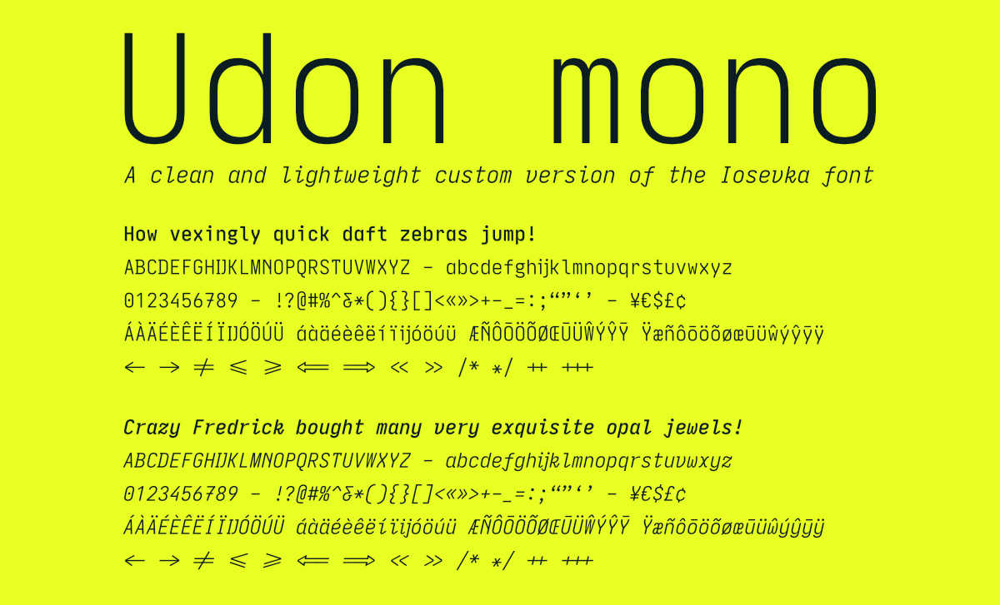

<picture>
  
</picture>

&nbsp;

**Udon mono** is a personal custom build of the [Iosevka font](https://github.com/be5invis/Iosevka). It takes inspiration from JetBrains Mono, Pragmata Pro, IBM Plex and Space Mono. My goal was to create a clean, versatile font with its own unique character that can be utilized in my various personal projects. Udon mono has the same extensive character set as Iosevka, covering over 200 languages and including a large collection of ligatures. You can find the most recent font builds in the *dist folder*.

See the comments in `private-build-plans.toml` for details on how to build a fresh set of fonts.

To customize Udon mono further and build your own fonts, see the [Iosevka build instructions](https://github.com/be5invis/Iosevka/blob/main/doc/custom-build.md) or [this walkthrough for macOS](https://kau.sh/blog/build-iosevka-font-mac-os/), and use the *private-build-plans* from this repository as a starting point.

The fonts are licensed according to the [Iosevka SIL Open Font License v1.1](https://github.com/bcorporaal/Udon-mono?tab=OFL-1.1-1-ov-file). Everything else in this repository is under a [MIT License](https://github.com/bcorporaal/Udon-mono?tab=MIT-2-ov-file).

&nbsp;

<picture>
  
</picture>